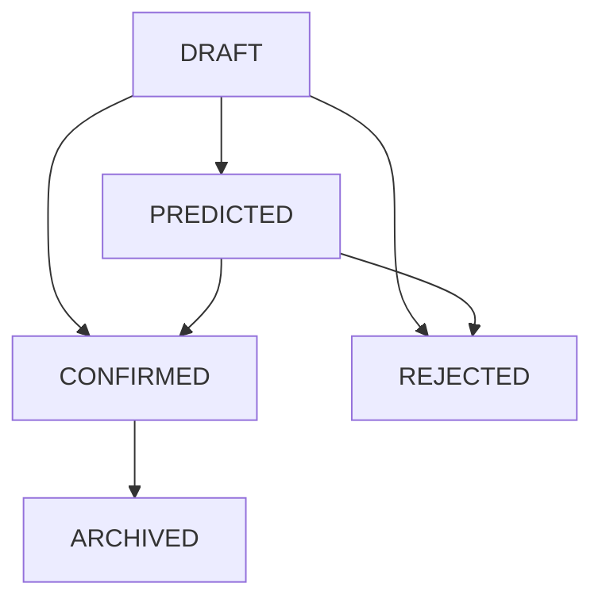
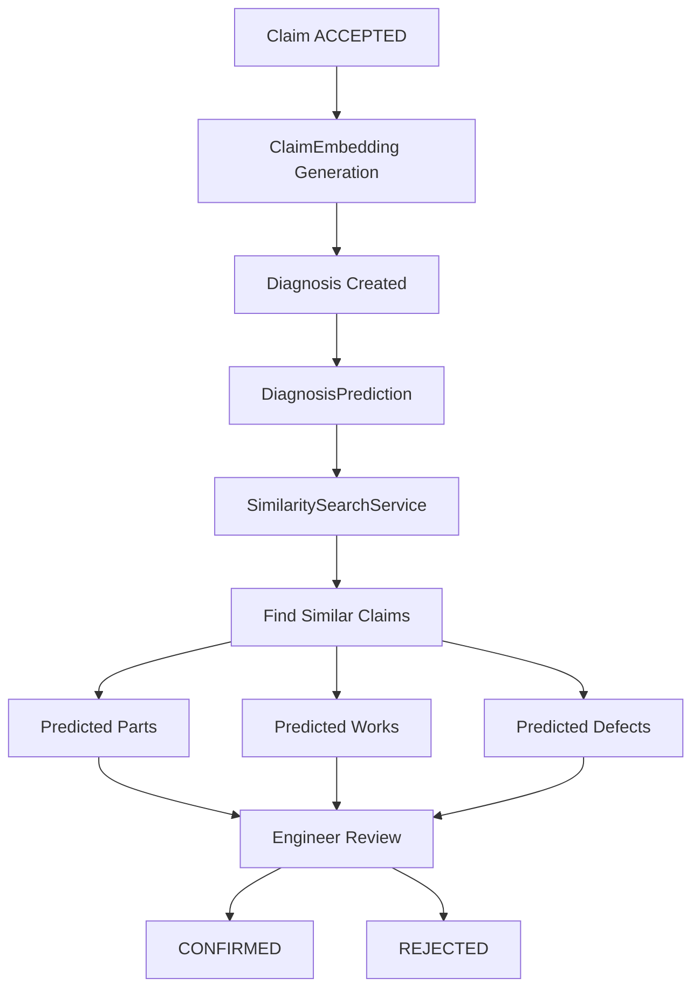
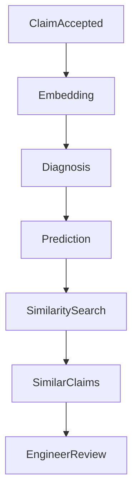
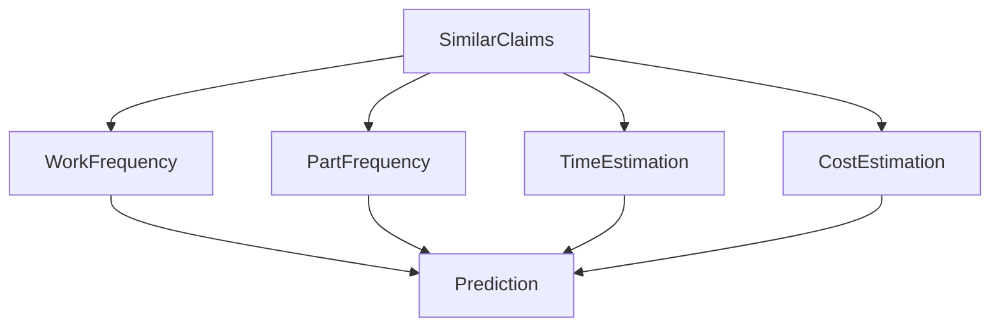

# MediRepairTrack DSS Architecture

Модуль DSS (Decision Support System) призначений для підтримки діагностики несправностей медичного 
обладнання на основі аналізу текстового опису дефекту та схожих історичних заявок.

Система не приймає остаточних рішень, а формує рекомендації для інженера.

Система використовує підхід:
- semantic embeddings
- cosine similarity
- case-based reasoning

## Navigation

- [Claim Embedding](#claim-embedding)
- [Embedding Generation Scenarios](#основні-сценарії-генерації-embedding)
- [Diagnosis](#diagnosis)
- [DiagnosisPrediction](#diagnosisprediction)
- [Similarity Search](#similarity-search)
- [Predicted Entities](#predicted-entities)
- [Pipeline](#dss-pipeline)
- [Manual Diagnosis](#ручна-діагностика-інженером)

---

# Claim Embedding

Embedding використовується для семантичного аналізу текстового опису несправності та пошуку схожих історичних заявок.

Embedding генерується через: `GeminiEmbeddingClient (Gemini API)` і зберігається у таблиці: `claim_embedding`

Embedding має розмірність 3072 та зберігається у вигляді бінарного масиву (BLOB) для оптимізації продуктивності.

Embedding містить два вектори:
- symptom_embedding — embedding текстового опису несправності
- context_embedding — embedding контексту обладнання

Контекст включає:
- equipment type
- manufacturer
- model
- defect description

---

# Основні сценарії генерації embedding

## 1. Генерація при прийнятті заявки

Коли заявка переходить у статус: `ACCEPTED` публікується подія: `ClaimStatusChangedEvent` яку обробляє: `ClaimEmbeddingListener`

Listener викликає: `EmbeddingService.generateIfMissing(claim)`

Метод:
1. перевіряє, чи існує embedding для заявки
2. якщо embedding відсутній — генерує його через Gemini API
3. якщо embedding вже існує — операція пропускається

Це дозволяє уникнути повторних викликів API.

---

## 2. Генерація за потреби (on-demand)

Embedding може бути згенерований у будь-який момент вручну або з іншого сервісу: `EmbeddingService.generateIfMissing(claim)`

Це використовується, наприклад, коли заявка знаходиться у статусі: `IN_REVIEW` і необхідно отримати попередній прогноз.

Метод безпечний для повторного виклику, оскільки embedding генерується лише якщо він відсутній.

---

## 3. Перегенерація embedding при зміні опису несправності

Якщо змінюється поле: `defect_description` публікується подія: `ClaimDescriptionChangedEvent`

Listener перевіряє статус заявки.

Перегенерація embedding виконується лише якщо статус заявки належить до:
- `ACCEPTED`
- `ASSIGNED_TO_ENGINEER`
- `IN_PROGRESS`
- `WAITING_FOR_PARTS`

У цьому випадку викликається: `EmbeddingService.regenerateEmbedding(claim)`

Метод:

1. видаляє старий embedding
2. генерує новий embedding через Gemini API
3. зберігає його у таблиці `claim_embedding`

---

# Чому embedding не генерується на ранніх етапах

На ранніх етапах життєвого циклу заявки: `NEW`, `IN_REVIEW`

опис дефекту може часто змінюватися через:

- уточнення клієнта
- уточнення менеджера
- додавання додаткових симптомів

Тому автоматична генерація embedding у цих статусах не виконується, щоб:

- зменшити кількість викликів Gemini API
- уникнути генерації embedding для некоректних або неповних описів

При цьому система дозволяє генерувати embedding за потреби вручну.

---

# Diagnosis

Основна сутність діагностики: `diagnosis`

Тип діагнозу:


| Дія             | diagnosis_type | prediction_source |
|-----------------|----|----|
| System (auto)   | AUTOMATED | AUTOMATED |
| Engineer manual | MANUAL | MANUAL |
| Engineer edited | HYBRID | HYBRID |

---

# Життєвий цикл Diagnosis



### Опис статусів

`DRAFT` - інженер створив або редагує діагностику

`PREDICTED` - Система створила прогноз

`CONFIRMED` - інженер підтвердив діагноз

`REJECTED` - Прогноз системи відхилено

`ARCHIVED` - старий або неактуальний діагноз

---

# Бізнес-правила переходів

- редагувати можна тільки **DRAFT** або **PREDICTED**
- підтверджувати можна тільки **DRAFT** або **PREDICTED**
- відхиляти можна тільки **PREDICTED**
- архівувати можна тільки **CONFIRMED**

---

# DiagnosisPrediction

Прогноз системи зберігається у таблиці: `diagnosis_prediction`

Вона містить:

- predicted_root_cause
- predicted_cost
- predicted_time_hours
- predicted_complexity_level
- confidence_score
- prediction_source
- model_version
- input_snapshot

Prediction є **окремим шаром між алгоритмом прогнозування та доменною сутністю Diagnosis**.

Це дозволяє:

- зберігати історію прогнозів
- оновлювати алгоритми прогнозування
- порівнювати результати прогнозів

---

# Similarity Search

Для прогнозування використовується підхід: `Case-Based Reasoning (CBR)`
Пошук виконується у: `SimilaritySearchService`

Алгоритм:

1. отримати embedding поточної заявки
2. знайти embeddings схожих заявок
3. обчислити cosine similarity
4. відсортувати результати
5. взяти TOP_K

Результати зберігаються у таблиці: `diagnosis_similarity_result`

Структура:
- prediction_id
- similar_claim_id
- similarity_score
- rank_position

---

# Автоматичне створення діагнозу

Коли заявка переходить у статус: `ACCEPTED`
публікується: `ClaimStatusChangedEvent` який запускає DSS pipeline.

---

# Predicted Entities

На основі схожих заявок система прогнозує:
- defect category
- repair works
- required parts
- repair time
- repair cost

Це робиться через агрегацію історичних даних.

## DiagnosisPredictedPart

Прогнозовані запчастини зберігаються у: `diagnosis_predicted_part`

Алгоритм:
1. отримати similarity results
2. знайти використані parts у схожих заявках
3. обчислити score: `score = similarity * quantity`
4. агрегувати score для кожної part
5. нормалізувати score: `probability = score / totalScore`
6. відсортувати
7. взяти `TOP_K`
8. відфільтрувати `min_probability`

Конфігурація:
```
dss.predicted-parts.top-k
dss.predicted-parts.min-probability
```

## DiagnosisPredictedWork

Прогнозовані ремонтні роботи зберігаються у таблиці: diagnosis_prediction_work.

Алгоритм прогнозування ремонтних робіт
1. отримати similarity results
2. знайти ремонтні роботи у схожих заявках (claim_work)
3. обчислити score для кожної роботи
4. агрегувати score
5. обчислити ймовірність
6. відсортувати результати
7. взяти 'TOP_K'
8. відфільтрувати за `min_probability`

Конфігурація:
```
dss.predicted-works.top-k
dss.predicted-works.min-probability
```

---

# DSS Pipeline



---

# Ручна діагностика інженером

Інженер може створити діагностику вручну.

Тригер: `Create diagnosis`

Процес:
- diagnosis
- diagnosis_type = MANUAL
- status = DRAFT
- fk_engineer = engineer_id

Prediction у цьому випадку: `prediction_source = MANUAL`

---

# Прогнозування за запитом (on-demand)

Інженер може запустити автоматичний прогноз вручну.

Тригер: `Generate system prediction`

Процес:

1. отримується embedding заявки
2. виконується similarity search
3. генерується prediction

Створюється:
- diagnosis_prediction
- prediction_source = AUTOMATED

---

# Інженер редагує прогноз системи

Інженер може змінити:

- predicted_operations
- predicted_parts
- predicted_cost
- predicted_time
- final_conclusion

Результат:
- diagnosis_type = HYBRID
- prediction_source = HYBRID
- status = PREDICTED

---

# Підтвердження діагнозу

Тригер: `Confirm diagnosis`
Результат:
- status = CONFIRMED
- confirmed_at = now()
- fk_engineer = engineer_id

---

# Відхилення діагнозу

Тригер: `Reject system diagnosis`

Результат: `status = REJECTED`

---

# Архітектура DSS

Pipeline системи виглядає так:



DSS використовує:

- Semantic embeddings
- Cosine similarity
- Case-based reasoning

# Prediction Aggregation

similar claims:
- work frequency
- parts frequency
- time estimation
- cost estimation




## Limitations

- відсутня ANN-індексація (пошук виконується повним перебором)
- продуктивність залежить від кількості embeddings у памʼяті
- точність прогнозу залежить від якості історичних даних
